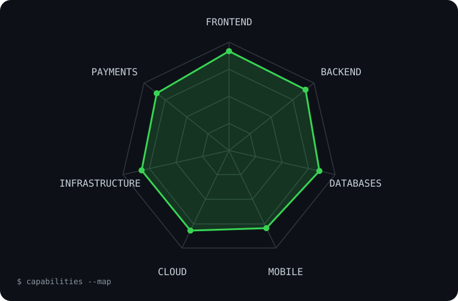

<div align="center">


[](http://muhibmirza-portfolio.vercel.app/)
[](https://linkedin.com/in/muhib-mirza-359390289)
[](https://instagram.com/muhibdev.ai)
[](https://facebook.com/muhib.mirza.52)


</div>

## `~/ whoami`

<table>
<tr>
<td width="68%" valign="top">

```console
muhib@viralage:~$ ./profile --verbose

name       Muhib Mirza
business   Viralage
location   Karachi, Pakistan
role       Full-stack developer
experience 4+ years
focus      Production web apps, ERP, LMS & e-commerce
method     Detailed AI prompting + iterative refinement
status     Building fast. Refining relentlessly.
```

I build production web applications end-to-end with **React.js, Next.js, Node.js, PHP, MySQL and MongoDB**. My work spans ERP systems, learning platforms and e-commerce products. I specialize in AI-assisted development: detailed technical prompting followed by deliberate, iterative refinement for fast, high-quality delivery.

</td>
<td width="32%" align="center" valign="middle">

</td>
</tr>
</table>

## `~/ toolbox`

<div align="center">

[](https://skillicons.dev)

`PHP (OOP/MVC)` · `React Native` · `JWT` · `JazzCash` · `Easypaisa` · `PayFast`

</div>

<details>
<summary><strong>View capability radar</strong></summary>
<br />
<div align="center">
  
</div>
</details>

## `~/ selected-work`

| Project | Live link | Stack / scope |
|:--|:--|:--|
| **BlueDash.ai** — 2-year SaaS engagement | [bluedash.ai](https://bluedash.ai/) | Course building, video editing and document tools |
| **Full-stack ERP system** — built end-to-end | Private business system | Full-stack architecture, business workflows and data management |
| **LMS platform** — US client | Private client project | Learning management workflows and production web development |
| **E-commerce platforms** — multiple builds | Private client projects | Storefronts, admin panels, databases and payment integrations |

> Selected commercial work is private. More details and public work are available on my [portfolio](http://muhibmirza-portfolio.vercel.app/).

## `~/ beyond-the-app`

```text
IT_INFRASTRUCTURE = [
  "network topology",
  "firewall configuration",
  "backup strategy",
  "disaster recovery"
]
```

## `~/ github-stats`

<div align="center">


</div>

## `~/ contribution-snake`

<picture>
  <source media="(prefers-color-scheme: dark)" srcset="https://raw.githubusercontent.com/Muhibmirza/Muhibmirza/output/github-contribution-grid-snake-dark.svg" />
  <source media="(prefers-color-scheme: light)" srcset="https://raw.githubusercontent.com/Muhibmirza/Muhibmirza/output/github-contribution-grid-snake.svg" />
  
</picture>

<div align="center">

```console
muhib@viralage:~$ echo "Let's build something useful."
Let's build something useful.
```

</div>
